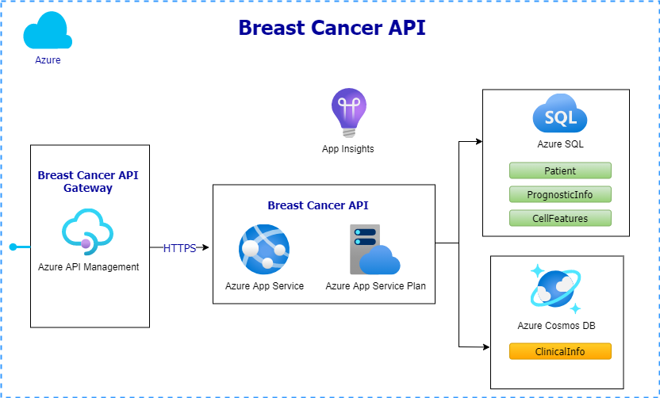

# Breast-Cancer-API

Breast Cancer API facilitates interations with breast cancer patient data. The registry has information about basic patient demographic information, prognostic and clinical data. One use case of this is API can be in hospitals and research institutes to maintain a cancer registry. Another usecase could be for machine learning models to call into the API for survival prediction(recurrence) and time to recur from prognostic information and Cell features. 

The API is developed in ASP.Net 5 and uses Entity framework core 5. The architectural layout for breast cancer API is shown below

### Entities
* Patient - Generic patient information
* PrognosticInfo - Contains breast cancer prognosis information for survival prediction
* CellFeatures - cell nuclei features computed from fNA biopsy images
* ClinicalInfo - Overall clinical information including diangosis, treatment, tests etc,.

The entities Patient, PrognosticInfo and Cell Features are deployed in Azure SQL DB. The clinicalInfo data is diverse and the schema is highly susceptible to change. It is hosted in Azure cosmos DB as a core SQL API. BreastCancerType field is chosen as the partition key as it makes logical sense to patition data based on a specific cancer type.

## Dataset
Dataset used for seeding the tables were taken from:

UCI Machine learning Repository - Wisconsin Dataset (Diagnostic / Prognostic)
https://archive.ics.uci.edu/ml/datasets/breast+cancer

## Technologies
* .NET 5
* Entity Framework Core 5.0.8
* AutoMapper 8.1.1
* Azure Cosmos 3.20.1